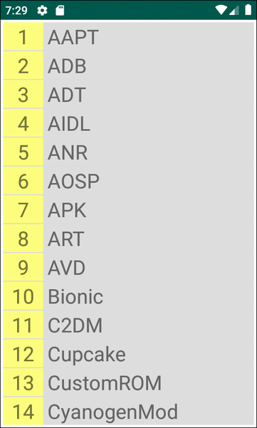
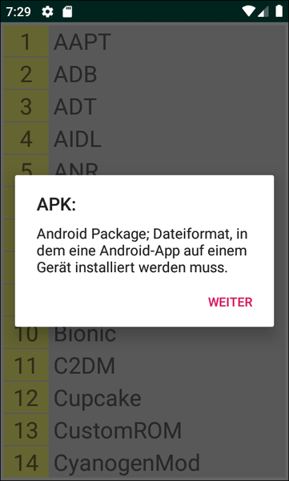

# Android-App "Glossar Android-Begriffe"

 

Dieses Repo enthält den Quellcode für eine native Android-App mit Java, die ein einfaches Glossar für Android-Begriffe implementiert.
Es soll damit die Verwendung des UI-Elements [ListView](https://developer.android.com/reference/android/widget/ListView) demonstriert werden.

Achtung: Es gibt inzwischen mit dem UI-Element [RecyclerView](https://developer.android.com/reference/androidx/recyclerview/widget/RecyclerView.html)
eine modernere Alternative für [ListView](https://developer.android.com/reference/android/widget/ListView)-Elemente.

 

----

## Screenshots ##

 

 &nbsp; 

 

----

## License ##

 

See the [LICENSE file](LICENSE.md) for license rights and limitations (BSD 3-Clause License).

 
